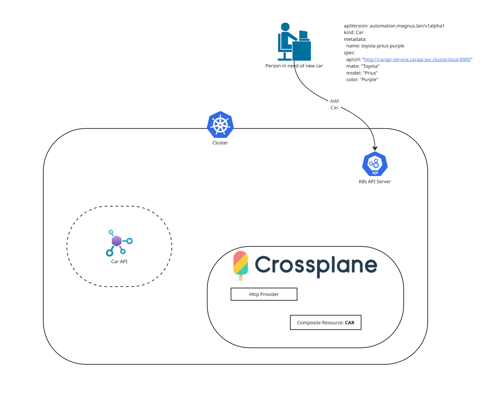

# Scenario



```bash
docker run -it --rm -p 8000:8000 ghcr.io/magohl/carapi:latest
```

# prereqs cli tools

- kubectl
- kind
- helm

````bash
# create new empty kubernetes cluster
kind create cluster

# deploy the api (this could be hosted here or elsewhere. It has nothing to do with Crossoplane!)
```bash
kubectl create namespace carapi
kubectl apply -f .manifests/carapi/.
````

## Check the Car API

```bash
kubectl run -it --rm=true --image=curlimages/curl:8.20.0 curl -- /bin/sh
curl -Lk -X GET http://carapi-service.carapi.svc.cluster.local:8000/api/cars
curl -Lk -X DELETE http://carapi-service.carapi.svc.cluster.local:8000/api/cars/...
```

# install crossplane in cluster
```bash
helm repo add crossplane-stable https://charts.crossplane.io/stable
helm repo update
helm install crossplane \
--namespace crossplane-system \
--create-namespace crossplane-stable/crossplane

# install crossplane provider for 'http'
kubectl apply -f 0-infra/crossplane/providers/azure/provider.yaml
kubectl apply -f .manifests/crossplane/providers/functions.yaml
kubectl apply -f .manifests/crossplane/providers/providerconfig.yaml

# install our custom crossplane resource 'Car' which uses a composition with the http provider
kubectl apply -f .manifests/crossplane/car/.
kubectl get cars #prove - we now have a resource type called car but there are no cars deployed

# place an order for a new car. But check the api first to see it change!
kubectl apply -f .manifests/crossplane/car/test/some-car.yaml
```

## runbook

- Deploy car-api
- Deploy crossplane XRD & Composition
- Deploy an order for a car
